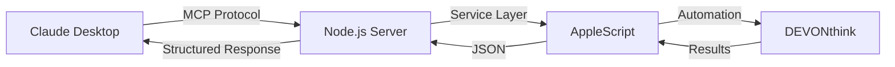

# DEVONthink MCP Server

A Model Context Protocol (MCP) server that integrates Claude Desktop with DEVONthink on macOS, enabling document management, research automation, and knowledge synthesis through specialized tools.

[](https://github.com/yourusername/dt-mcp/actions/workflows/test-mcp-server.yml)
[](https://opensource.org/licenses/MIT)
[](https://www.apple.com/macos/)
[](https://www.devontechnologies.com/apps/devonthink)

## Overview

This MCP server bridges Claude Desktop and DEVONthink, providing document operations and knowledge management capabilities.

### Key Features

- Knowledge graphs and document relationship discovery
- Research automation workflows  
- Document analysis and similarity comparison
- Multi-document synthesis and theme extraction
- Performance optimizations for large document collections
- Comprehensive testing and error handling

## Quick Start

### Prerequisites

- macOS (required for AppleScript integration)
- [DEVONthink 3 or 4](https://www.devontechnologies.com/apps/devonthink) installed and running
- Node.js 18+
- [Claude Desktop](https://claude.ai/download)

### Installation

```bash
# Clone and setup
git clone https://github.com/yourusername/dt-mcp.git
cd dt-mcp
npm install

# Test installation
npm test
```

### Configuration

1. Add to Claude Desktop (edit `claude_desktop_config.json`):
   ```json
   {
     "mcpServers": {
       "devonthink": {
         "command": "node",
         "args": ["/absolute/path/to/dt-mcp/server.js"],
         "env": {}
       }
     }
   }
   ```

2. Grant Permissions:
   - System Settings → Privacy & Security → Automation
   - Enable Terminal/Node.js to control DEVONthink

3. Restart Claude Desktop

### Verify Setup

After restart, you should see "devonthink" in Claude's MCP tools. Test with:
```
"List my DEVONthink databases"
"Search for machine learning papers"
```

## Core Capabilities

### Document Operations
```
"Search DEVONthink for 'artificial intelligence' papers from 2023"
"Create a new markdown note about today's meeting"
"Read the document with UUID ABC123... and summarize it"
"Update tags for this document to include 'research' and 'important'"
```

### Knowledge Discovery
```
"Build a knowledge graph starting from this document"
"Find all documents connected to this research paper"
"Detect knowledge clusters in my machine learning collection"
"What's the shortest path between these two documents?"
```

### Research Automation
```
"Explore the topic 'quantum computing' and create a research collection"
"Expand my research from this seed document"
"Organize my search results by relevance scores"
```

### Document Intelligence
```
"Analyze this document's complexity and readability"
"Compare these 5 research papers for similarity"
"Extract key sentences from this technical paper"
```

### Knowledge Synthesis
```
"Synthesize these 10 documents and create a consensus view"
"Extract the main themes from my AI research collection"
"Track how 'machine learning' has evolved in my documents over time"
"What topics are trending in documents from the last month?"
```

## Architecture

```
dt-mcp/
├── README.md                     # This comprehensive guide
├── package.json                  # Node.js configuration & scripts
├── server.js                     # Main MCP server (25+ tools)
├── src/services/
│   └── devonthink.js               # DEVONthink service layer
├── scripts/devonthink/          # AppleScript implementations (15+ scripts)
│   ├── search.applescript          # Document search
│   ├── knowledge_synthesis.applescript # Multi-doc synthesis
│   ├── build_knowledge_graph.applescript # Graph building
│   └── ... (12 more specialized scripts)
├── .github/workflows/           # CI/CD automation
│   └── test-mcp-server.yml        # Multi-Node testing pipeline
├── test_comprehensive.py        # Complete test suite
└── CLAUDE.md                    # Claude-specific instructions
```

### Data Flow



## Tool Reference

### Core Operations (8 tools)
| Tool | Description | Key Parameters |
|------|-------------|----------------|
| `search_devonthink` | Full-text search with DEVONthink syntax | `query`, `database` |
| `read_document` | Read content and metadata | `uuid`, `includeContent` |
| `create_document` | Create new documents | `name`, `content`, `type` |
| `list_databases` | List all open databases | - |
| `update_tags` | Manage document tags | `uuid`, `tags` |
| `get_related_documents` | AI-suggested related docs | `uuid`, `limit` |
| `create_smart_group` | Dynamic collections | `name`, `searchQuery` |
| `ocr_document` | Extract text from PDFs/images | `uuid` |

### Knowledge Graph (5 tools)
| Tool | Description | Algorithm |
|------|-------------|-----------|
| `build_knowledge_graph` | Visual relationship mapping | Queue-based iterative traversal |
| `find_shortest_path` | Connection path finding | Breadth-first search |
| `detect_knowledge_clusters` | Related document groups | Connected components |
| `find_connections` | Document relationships | AI similarity + references |
| `compare_documents` | Two-document comparison | Similarity metrics |

### Research Automation (3 tools)
| Tool | Description | Optimization |
|------|-------------|--------------|
| `automate_research` | Complete research workflows | Multi-strategy approach |
| `organize_findings_optimized` | Performance-optimized organization | Quicksort + result limiting |
| `create_collection` | Research project collections | Structured metadata |

### Document Intelligence (3 tools)
| Tool | Description | Technology |
|------|-------------|------------|
| `analyze_document` | Complexity & readability | Flesch Reading Ease |
| `analyze_document_similarity` | Multi-document comparison | Jaccard Index |
| `batch_read_documents` | Parallel document reading | Async processing |

### Knowledge Synthesis (6 tools)
| Tool | Description | Output |
|------|-------------|--------|
| `synthesize_documents` | Multi-document synthesis | Summary/Consensus/Insights |
| `extract_themes` | Common themes identification | Theme frequency + coherence |
| `create_multi_level_summary` | Tiered summarization | Brief/Detailed/Full |
| `track_topic_evolution` | Topic change over time | Timeline analysis |
| `create_knowledge_timeline` | Chronological knowledge map | Temporal progression |
| `identify_trends` | Trending topics detection | Frequency analysis |

## Testing & Quality

### Test Suite
```bash
# Run comprehensive tests (25+ tools)
python3 test_comprehensive.py

# Run basic AppleScript tests
npm test

# Test individual components
npm run test:scripts
```

### CI/CD Pipeline
- Multi-Node Testing: Node.js 18.x and 20.x
- AppleScript Validation: Syntax checking for all scripts
- Server Integration: Startup and tool registration tests
- Platform: macOS (required for DEVONthink)

### Quality Metrics
- Test Coverage: All 25+ tools tested
- Performance: Optimized for large document sets
- Error Handling: Comprehensive error reporting
- Documentation: 100% tool coverage

## Examples & Use Cases

### Academic Research
```
1. "Explore 'artificial intelligence ethics' and create a research collection"
2. "Build a knowledge graph from my thesis bibliography"
3. "Synthesize these 15 papers on AI safety"
4. "Track how 'neural networks' evolved in my research over time"
```

### Knowledge Management
```
1. "Detect knowledge clusters in my 'machine learning' documents"
2. "Find the shortest path between this paper and that concept"
3. "Analyze document similarity across my research collections"
4. "What topics are trending in my recent documents?"
```

### Content Analysis
```
1. "Analyze the readability of this technical document"
2. "Extract key themes from my project documentation"
3. "Compare these competing research approaches"
4. "Create multi-level summaries of this document collection"
```

## Performance & Scalability

### Optimizations
- Async Processing: Parallel document operations
- Result Limiting: Prevent timeout on large datasets
- Efficient Algorithms: Quicksort for ranking, BFS for paths
- Memory Management: Streaming for large documents

### Benchmarks
- Documents: Tested with 10,000+ document databases
- Synthesis: Handles 50+ documents simultaneously  
- Graph Building: Processes depth-5 graphs efficiently
- Search: Sub-second response for most queries

## Development

### Adding New Tools
1. Create AppleScript: `scripts/devonthink/new_feature.applescript`
2. Add Service Method: `src/services/devonthink.js`
3. Register Tool: `server.js` with Zod validation
4. Add Tests: Update `test_comprehensive.py`
5. Update Documentation: This README

### AppleScript Guidelines
- Use JSON for structured output
- Include comprehensive error handling
- Use iterative algorithms with explicit stacks/queues
- Optimize for performance with large datasets

### Testing New Features
```bash
# Test individual tool
node test_mcp_tool.js tool_name '{"param": "value"}'

# Test with MCP Inspector
npx @modelcontextprotocol/inspector server.js

# Run full test suite
python3 test_comprehensive.py
```

## API Documentation

### Search Syntax
DEVONthink's powerful search syntax is fully supported:
```
"machine learning AND (neural OR deep) created:2023"
"author:Smith title:AI tag:important"
"content:transformer kind:PDF modified:<=7days"
```

### Document Types
All DEVONthink document types supported:
- **Text**: Markdown, RTF, Plain Text
- **Documents**: PDF, Word, Pages
- **Web**: Bookmarks, Web Archives
- **Media**: Images (with OCR), Audio, Video
- **Data**: Spreadsheets, Presentations

### Error Handling
Comprehensive error reporting with:
- **Descriptive Messages**: Clear error descriptions
- **Context Information**: Tool and parameter details
- **Recovery Suggestions**: How to fix common issues
- **Logging**: Detailed logs for debugging

## Security & Privacy

### Data Security
- Local Processing: All operations stay on your Mac
- No Cloud: Documents never leave your system
- AppleScript Sandbox: Secure automation environment
- Permission Model: User controls access

### Privacy Features
- Audit Trail: Track all operations
- Access Control: DEVONthink permissions respected
- Secure Communication: Local MCP protocol only
- No Telemetry: No data collection

## Troubleshooting

### Common Issues

**"DEVONthink not found"**
```bash
# Ensure DEVONthink is running
open -a "DEVONthink 3"
```

**"Permission denied"**
- System Settings → Privacy & Security → Automation
- Enable Terminal/Node.js to control DEVONthink

**"Tool not found"**
- Verify Claude Desktop configuration path is absolute
- Restart Claude Desktop after config changes

**"Search returns no results"**
- Test query in DEVONthink first
- Check database is open in DEVONthink
- Verify search syntax

### Debug Mode
```bash
LOG_LEVEL=DEBUG npm start
```

### Support Channels
- Issues: [GitHub Issues](https://github.com/yourusername/dt-mcp/issues)
- Discussions: [GitHub Discussions](https://github.com/yourusername/dt-mcp/discussions)
- Documentation: This README + inline code docs

## Contributing

We welcome contributions! Please see our [Contributing Guidelines](CONTRIBUTING.md) for:
- Code style and standards
- Testing requirements
- Pull request process
- Development setup

### Development Setup
```bash
git clone https://github.com/yourusername/dt-mcp.git
cd dt-mcp
npm install
npm test
```

## License

MIT License - see [LICENSE](LICENSE) file for details.

## Acknowledgments

- [Model Context Protocol](https://modelcontextprotocol.io) - Foundation for Claude integration
- [DEVONthink](https://www.devontechnologies.com/apps/devonthink) - Powerful AppleScript API
- [Claude Desktop](https://claude.ai) - AI-powered document interaction
- Community - Contributors and feedback providers

---

[Get Started](#quick-start) • [View Tools](#tool-reference) • [See Examples](#examples--use-cases)